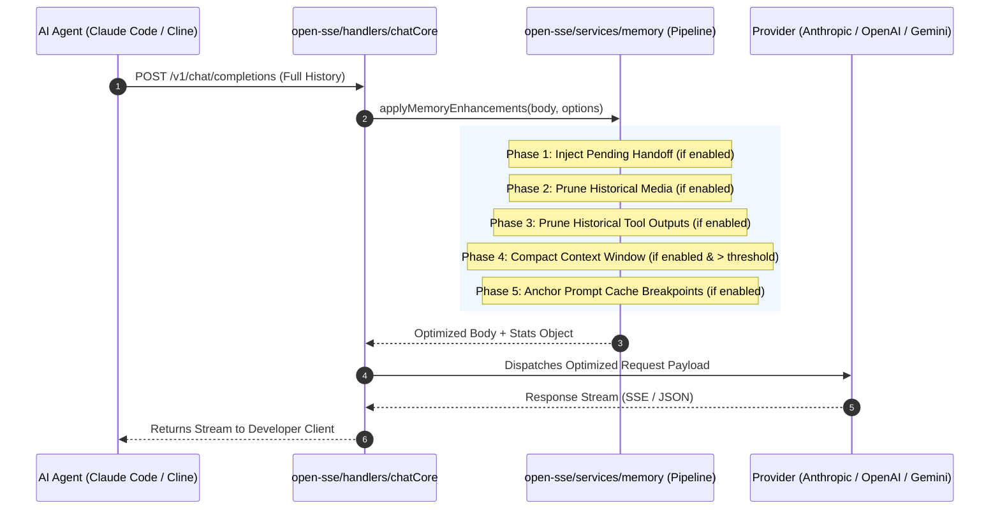

# AI Memory & Token Optimization Technical Reference

_Last updated: 2026-08-28_

## 1. Overview & Architecture

The **AI Memory & Token Optimizer** in 9Router provides a modular context lifecycle and token optimization pipeline inspired by [`akitaonrails/ai-memory`](https://github.com/akitaonrails/ai-memory). It is engineered specifically for long-running multi-turn agentic coding sessions (Claude Code, Cline, Roo Code, Codex, OpenClaw, Continue) to reduce prompt token consumption by **40%–80%** while preserving strict schema adherence, tool-calling contracts, and model reasoning integrity.

### 1.1 Non-Lossy vs. Lossy Optimizations

The memory system categorizes operations into two distinct classes:

- **Non-Lossy Optimizations (Enabled by Default)**:
  - *Prompt Cache Breakpoint Anchoring*: Places deterministic cache control markers without mutating prompt content or discarding information. Maximizes provider cache hit rates (up to 90% discount).
- **Lossy / Destructive Optimizations (Opt-in by Default)**:
  - *Historical Tool Pruning*: Truncates older tool outputs. Disabled by default to protect RAG queries, web searches, and file dumps from truncation unless the user explicitly opts in.
  - *Historical Media Pruning*: Omits base64 image/audio payloads from previously answered turns. Disabled by default to allow models to re-reference earlier images without requiring re-upload.
  - *Sliding Window Context Compaction*: Summarizes older turns when crossing large token thresholds (default: 128k tokens).

### 1.2 Pipeline Execution Flow

When a chat completion request arrives at `/v1/chat/completions`, `open-sse/handlers/chatCore` invokes `applyMemoryEnhancements()` before dispatching the request to the upstream provider:



---

## 2. Comprehensive Module & Parameter Reference

### Module 1: Master Pipeline Orchestrator
- **Source File**: [`open-sse/services/memory/index.js`](file:///home/daniel/Code/9router/open-sse/services/memory/index.js)
- **Primary Function**: `applyMemoryEnhancements(body, options)`

#### Function Arguments & Options
| Argument / Property | Type | Default | Required | Description |
|---|---|---|---|---|
| `body` | `Object` | — | Yes | The incoming request body containing `messages`, `input`, `contents`, `system`, and/or `tools`. |
| `options` | `Object` | `{}` | No | Configuration options and contextual parameters. |
| `options.settings` | `Object` | `{}` | No | Settings object resolved from the 9router database repository. |
| `options.targetFormat`| `string` | `"openai"` | No | Target provider format: `"openai"`, `"claude"`, `"anthropic"`, `"gemini"`. |
| `options.projectKey` | `string` | `undefined` | No | Project path identifier used for directory-scoped handoff store matching. |
| `options.log` | `Object` | `undefined` | No | Logger instance providing `.info()`, `.debug()`, and `.warn()` methods. |

#### Return Value
```typescript
Promise<{
  body: Object,
  stats: {
    toolPruning: { applied: boolean, savedChars: number },
    mediaPruning: { applied: boolean, savedItems: number },
    compaction: { applied: boolean, savedTokens: number },
    cacheAnchor: { applied: boolean },
    handoff: { applied: boolean }
  }
}>
```

---

### Module 2: Historical Tool Output Pruner
- **Source File**: [`open-sse/services/memory/toolPruner.js`](file:///home/daniel/Code/9router/open-sse/services/memory/toolPruner.js)
- **Primary Function**: `pruneHistoricalTools(body, options)`

#### Behavioral Details
In multi-turn agentic loops, commands like `cat`, `grep`, `git diff`, and compiler build logs generate huge tool outputs. Older tool outputs (from turns preceding the active working set) are bounded while preserving the most recent $K$ tool results completely unpruned.

#### Configurable Options & Settings
| Option / DB Setting Key | Type | Default | Valid Range / Format | What It Modifies |
|---|---|---|---|---|
| `enabled` / `memoryToolPruningEnabled` | `boolean` | `false` | `true` \| `false` | Enables or disables historical tool result truncation. |
| `keepRecentTurns` / `memoryMaxToolTurnsKeepFull` | `number` | `2` | `1` to `10` (integer) | The number of most recent tool result turns that are guaranteed to remain 100% intact. |
| `maxHistoricalChars` / `memoryMaxHistoricalToolChars` | `number` | `4000` | `100` to `16000` (step: `500`) | The maximum character length allowed for older tool outputs. |

#### Payload Transformation
When a tool output exceeds `maxHistoricalChars`, the content is split into **70% head** and **30% tail**, inserting a standard truncation banner:
```text
[... Tool output truncated by 9router memory optimizer: 120 lines / 4500 chars omitted ...]
```

#### Supported Tool Structures
- **OpenAI / Open-SSE**: Messages with `role: "tool"` or `role: "function"`, and content blocks with `type: "tool_result"`.
- **Anthropic Claude**: User content blocks where `type === "tool_result"`.
- **Google Gemini**: Parts where `part.functionResponse` is present.

---

### Module 3: Historical Media & Attachment Pruner
- **Source File**: [`open-sse/services/memory/mediaPruner.js`](file:///home/daniel/Code/9router/open-sse/services/memory/mediaPruner.js)
- **Primary Function**: `pruneHistoricalMedia(body, options)`

#### Behavioral Details
When users submit images (screenshots, UI mockups, diagrams) or audio files in multi-turn chats, the agent framework repeatedly re-sends multi-megabyte base64 URIs on every turn. This module keeps all media in the active trailing user turn intact, while stripping historical media blocks that were already processed and answered in previous assistant turns.

#### Configurable Options & Settings
| Option / DB Setting Key | Type | Default | Valid Range / Format | What It Modifies |
|---|---|---|---|---|
| `enabled` / `memoryMediaPruningEnabled` | `boolean` | `false` | `true` \| `false` | Enables or disables pruning of base64 images, audio, and attachments from historical turns. |

#### Payload Transformation
- **Base64 Data URIs**: `data:image/...;base64,...` in strings are replaced with `[Historical base64 media omitted by 9router]`.
- **Content Blocks**: Content blocks of type `image_url`, `image`, `input_image`, `input_audio`, `audio_url`, `input_video`, etc., are converted to lightweight text placeholders:
  ```json
  {
    "type": "text",
    "text": "[Historical image_url omitted by 9router memory optimizer]"
  }
  ```
- **Gemini Parts**: `inlineData` and `fileData` parts are replaced with text placeholders.
- **Message Attachments**: `msg.images` and `msg.experimental_attachments` arrays on historical messages are cleared.

---

### Module 4: Sliding Window Context Compactor
- **Source File**: [`open-sse/services/memory/contextCompactor.js`](file:///home/daniel/Code/9router/open-sse/services/memory/contextCompactor.js)
- **Primary Functions**:
  - `compactContextWindow(body, options)`: Performs distillation and compaction.
  - `estimateTokenCount(items)`: Fast conservative token estimation (~3.8 chars/token).

#### Behavioral Details
When conversations reach 50–100+ turns, message history can approach context limits, causing extreme latency and high costs. The compactor preserves the system instruction at index 0 and the most recent $K$ conversation turns, distilling earlier turns (turns 1 to $N-K$) into a single structured summary block.

#### Configurable Options & Settings
| Option / DB Setting Key | Type | Default | Valid Range / Format | What It Modifies |
|---|---|---|---|---|
| `enabled` / `memoryCompactionEnabled` | `boolean` | `false` | `true` \| `false` | Enables or disables sliding window context compaction. |
| `thresholdTokens` / `memoryCompactionThresholdTokens` | `number` | `128000` | `4000` to `512000` (step: `8000`) | The estimated prompt token threshold required to trigger compaction. |
| `recentTurnsToKeep` / `memoryRecentTurnsToKeep` | `number` | `8` | `2` to `30` (step: `1`) | Number of most recent conversation turns kept completely untouched. |

#### Payload Transformation
Older messages are removed and replaced by a consolidated summary block inserted immediately following the system instruction:
```markdown
[Historical Context Summary by 9router Memory Optimizer]
Notice: Earlier conversation turns (24 messages) have been compacted to conserve context window.
Key highlights of earlier conversation:
- USER: Create database migration for PostgreSQL schema
- ASSISTANT: Generated schema migration and updated repository
- USER: Run integration test suite
- ASSISTANT: [tool result: 14 tests passing]
```

---

### Module 5: Prompt Cache Breakpoint Anchoring
- **Source File**: [`open-sse/services/memory/cacheAnchor.js`](file:///home/daniel/Code/9router/open-sse/services/memory/cacheAnchor.js)
- **Primary Function**: `anchorPromptCache(body, options)`

#### Behavioral Details
Providers like Anthropic Claude, Google Gemini, and OpenAI offer prompt caching discounts (up to 90% reduction on cached tokens) when prefixes remain identical. This module automatically places cache control breakpoints on the static system prompt and tool definitions.

#### Configurable Options & Settings
| Option / DB Setting Key | Type | Default | Valid Range / Format | What It Modifies |
|---|---|---|---|---|
| `enabled` / `memoryCacheAnchorEnabled` | `boolean` | `true` | `true` \| `false` | Enables or disables automatic placement of cache control breakpoints. |
| `format` | `string` | `"claude"` | `"claude"` \| `"anthropic"` \| `"openai"` \| `"gemini"` | Target provider protocol for placing cache markers. |

#### Payload Transformation
For Anthropic Claude format:
- Converts string system instructions into structured cache blocks:
  ```json
  "system": [
    {
      "type": "text",
      "text": "You are an expert AI software architect...",
      "cache_control": { "type": "ephemeral" }
    }
  ]
  ```
- Adds `"cache_control": { "type": "ephemeral" }` to the last tool definition in `body.tools`.

---

### Module 6: Cross-Session Handoff Store
- **Source File**: [`open-sse/services/memory/handoffStore.js`](file:///home/daniel/Code/9router/open-sse/services/memory/handoffStore.js)
- **Primary Functions**:
  - `recordHandoff(projectKey, handoffData)`: Stores a structured handoff packet.
  - `getHandoff(projectKey)`: Retrieves the active handoff for a project.
  - `injectPendingHandoff(body, options)`: Injects handoff summary into the first user message of a new session.
  - `consumeHandoff(projectKey)`: Consumes and evicts handoff from memory.

#### Behavioral Details
When developers switch tools within the same project directory (e.g. from Claude Code to Codex or Cline), context is usually lost. The handoff store keeps a bounded in-memory registry (up to 500 entries) keyed by project directory and injects previous session accomplishments and pending tasks into the new session.

#### Configurable Options & Settings
| Option / DB Setting Key | Type | Default | Valid Range / Format | What It Modifies |
|---|---|---|---|---|
| `enabled` / `memoryHandoffEnabled` | `boolean` | `false` | `true` \| `false` | Enables or disables cross-session handoff continuity. |
| `projectKey` | `string` | `undefined` | String path / UUID | Key identifier representing the project workspace. |

#### Payload Transformation
Prepends the stored handoff text directly to the first user message:
```text
[Previous Agent Handoff Context (via 9router)]:
Auth module refactoring completed. JWT token refresh tests still pending.
---
<User's initial prompt message>
```

---

## 3. Configuration Surfaces Reference Matrix

Every memory parameter can be inspected and updated through multiple interfaces:

| Parameter Name | DB / Settings Key | REST API (`PATCH /api/settings`) | Web Dashboard (`/dashboard/memory`) | Terminal CLI (`🧠 AI Memory Menu`) |
|---|---|---|---|---|
| **Tool Pruning Toggle** | `memoryToolPruningEnabled` | `{"memoryToolPruningEnabled": false}` | Toggle switch in "Historical Tool Output Pruning" card | Menu Item 1: `Tool Output Pruning: ON/OFF` |
| **Tool Keep Full Turns** | `memoryMaxToolTurnsKeepFull` | `{"memoryMaxToolTurnsKeepFull": 2}` | Number input: "Keep Recent Tool Turns Full" (`1`–`10`) | Header details: `(keep K recent turns)` |
| **Tool Max Chars** | `memoryMaxHistoricalToolChars` | `{"memoryMaxHistoricalToolChars": 4000}` | Number input: "Max Historical Output Length" (`100`–`16000`) | Header details: `(max C chars)` |
| **Media Pruning Toggle** | `memoryMediaPruningEnabled` | `{"memoryMediaPruningEnabled": false}` | Toggle switch in "Historical Media Pruning" card | Menu Item 2: `Media Pruning: ON/OFF` |
| **Compaction Toggle** | `memoryCompactionEnabled` | `{"memoryCompactionEnabled": false}` | Toggle switch in "Sliding Window Context Compaction" card | Menu Item 3: `Sliding Compaction: ON/OFF` |
| **Compaction Threshold**| `memoryCompactionThresholdTokens`| `{"memoryCompactionThresholdTokens": 128000}` | Number input: "Compaction Token Threshold" (`4k`–`512k`) | Header details: `(threshold: T tokens)` |
| **Compaction Keep Turns**| `memoryRecentTurnsToKeep` | `{"memoryRecentTurnsToKeep": 8}` | Number input: "Recent Turns to Keep Intact" (`2`–`30`) | — |
| **Cache Anchor Toggle** | `memoryCacheAnchorEnabled` | `{"memoryCacheAnchorEnabled": true}` | Toggle switch in "Prompt Cache Breakpoint Anchoring" card | Menu Item 4: `Cache Breakpoint Anchor: ON/OFF` |
| **Handoff Toggle** | `memoryHandoffEnabled` | `{"memoryHandoffEnabled": false}` | Toggle switch in "Cross-Session Handoff Continuity" card | Menu Item 5: `Cross-Session Handoff: ON/OFF` |

---

## 4. Programmatic Usage Example

```javascript
import { applyMemoryEnhancements } from "./open-sse/services/memory/index.js";

const incomingRequestBody = {
  system: "You are a senior fullstack assistant.",
  messages: [
    { role: "user", content: "Run tests" },
    { role: "assistant", content: "Executing tests", tool_calls: [{ id: "t1", function: { name: "test" } }] },
    { role: "tool", tool_call_id: "t1", content: "PASS test/a.js\n".repeat(300) },
    { role: "user", content: "Now build project" }
  ]
};

const userSettings = {
  memoryToolPruningEnabled: true,
  memoryMaxToolTurnsKeepFull: 1,
  memoryMaxHistoricalToolChars: 2000,
  memoryCacheAnchorEnabled: true
};

const { body, stats } = await applyMemoryEnhancements(incomingRequestBody, {
  settings: userSettings,
  targetFormat: "claude",
  projectKey: "/home/user/code/project",
  log: console
});

console.log("Optimization Stats:", stats);
// stats.toolPruning.applied === true
// stats.cacheAnchor.applied === true
```

---

## 5. Verification & Testing

To execute and verify all unit tests for memory modules:

```bash
node --test tests/unit/memory-enhancements.test.js
```

All 7 test suites validate:
1. Tool Pruning isolation and recent turn retention.
2. Media Pruning placeholder replacement and active turn preservation.
3. Sliding window context distillation and summary generation.
4. Prompt cache breakpoint insertion across provider formats.
5. Handoff store recording, retrieval, and injection lifecycle.
6. Safe non-destructive defaults verification (pruners disabled when unconfigured).
7. Master orchestrator modular toggle handling.
